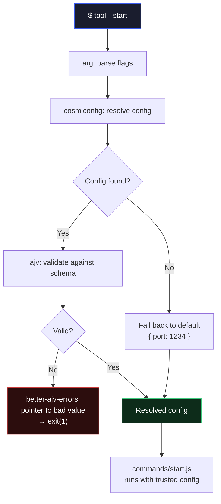

<div align="center">

# ⚙️CLI tool

### A config-driven CLI that validates itself — and fails loudly when something's wrong

[](https://nodejs.org/)
[](./LICENSE)

*Most CLI tutorials stop at "parse some flags and print something."*
*This one treats configuration as data that has to earn its trust — not something to assume is correct.*

[Features](#-what-it-does) · [Architecture](#-architecture) · [Run it](#-running-it-locally)

</div>

<br>

## 🎯 The Problem

A CLI tool that silently accepts bad configuration fails its user at the worst possible time — mid-run, with a confusing downstream error that has nothing to do with the actual mistake. There's no signal that anything was wrong until something breaks three steps later.

**`tool` was built to fail at the boundary instead — immediately, and with a precise pointer to the problem.**

<br>

## ✨ What It Does

<table>
<tr>
<td width="50%" valign="top">

### 🧵 Minimal Flag Parsing
Built on [`arg`](https://github.com/vercel/arg) — no magic, no implicit coercion. Unknown flags are rejected explicitly rather than silently ignored.

</td>
<td width="50%" valign="top">

### 🔎 Cascading Configuration
Config is resolved via [`cosmiconfig`](https://github.com/cosmiconfig/cosmiconfig) — checked in order: a `tool.config.js` file, a `"tool"` field in `package.json`, then a hard-coded default. No config file required to get started.

</td>
</tr>
<tr>
<td width="50%" valign="top">

### 🛡️ Schema-Enforced Config
Every resolved config is validated against a JSON Schema with [`ajv`](https://ajv.js.org/) *before* it reaches application code. Invalid config never propagates downstream.

</td>
<td width="50%" valign="top">

### 📍 Readable Validation Errors
Validation failures are rendered with [`better-ajv-errors`](https://github.com/atlassian/better-ajv-errors) — an inline pointer at the exact bad value, not a wall of raw JSON Schema output.

</td>
</tr>
<tr>
<td width="50%" valign="top">

### 🪵 Namespaced Debug Logging
Every stage logs behind [`debug`](https://github.com/debug-js/debug), silent by default. `DEBUG=*` traces the full run; `DEBUG=commands:*` scopes to one module.

</td>
<td width="50%" valign="top">

### 🎨 Legible Terminal Output
Status, warnings, and errors are visually distinct via [`chalk`](https://github.com/chalk/chalk) — color carries meaning, not decoration.

</td>
</tr>
</table>

<br>

## 🏗️ Architecture



<br>

## 🛠️ Tech Stack

<div align="center">

| Layer | Technology |
|:---|:---|
| **Flag parsing** | [`arg`](https://github.com/vercel/arg) |
| **Config resolution** | [`cosmiconfig`](https://github.com/cosmiconfig/cosmiconfig) |
| **Schema validation** | [`ajv`](https://ajv.js.org/) |
| **Validation errors** | [`better-ajv-errors`](https://github.com/atlassian/better-ajv-errors) |
| **Logging** | [`debug`](https://github.com/debug-js/debug) |
| **Terminal styling** | [`chalk`](https://github.com/chalk/chalk) |

</div>

<br>

## 🚀 Running It Locally

```bash
git clone https://github.com/Sahoo999/tool.git
cd tool
npm install
npm link
```

`npm link` makes `tool` available globally, backed by this local source.

```bash
tool --start
```

Trace the full run:

```bash
DEBUG=* tool --start
```

<br>

## 📁 Project Structure

```
tool/
├── bin/
│   └── index.js              # Entry point — flag parsing, usage text
├── src/
│   ├── commands/
│   │   └── start.js          # --start implementation
│   └── config/
│       ├── config-mgr.js     # Resolve + validate config
│       └── schema.js         # JSON Schema for tool.config.js
├── package.json
└── README.md
```

<br>

## 💡 Design Decisions Worth Knowing

<details>
<summary><b>Why validate config with a schema instead of just checking types inline?</b></summary>
<br>
Inline checks scale badly and drift from the actual shape of the config over time. A schema is a single source of truth that both validates and documents what a valid config looks like — and <code>ajv</code> compiles it to a fast validator rather than re-parsing on every call.
</details>

<details>
<summary><b>Why <code>better-ajv-errors</code> instead of raw <code>ajv.errors</code>?</b></summary>
<br>
Raw Ajv errors are structured for machines — <code>keyword</code>, <code>dataPath</code>, <code>schemaPath</code>. A person running this CLI shouldn't have to mentally parse a JSON Schema error object to find out they wrote <code>"6666"</code> instead of <code>6666</code>. An inline pointer answers the question in half a second.
</details>

<details>
<summary><b>Why <code>debug</code> instead of plain <code>console.log</code>?</b></summary>
<br>
Unconditional logging either clutters normal output or gets stripped out entirely when it's no longer needed. Namespacing logs behind <code>debug</code> means they cost nothing at runtime by default, and full tracing is one environment variable away without touching code.
</details>

<details>
<summary><b>Why does config resolution fall back instead of failing when no file is found?</b></summary>
<br>
Missing config and <i>invalid</i> config are different failure modes and deserve different responses. No config file is a normal, expected state for a first run — falling back to a sane default keeps the tool usable out of the box. An invalid config, on the other hand, is an explicit mistake and is rejected outright rather than silently coerced.
</details>

<br>

---

<div align="center">

### 📬 Let's Connect

[](mailto:sahoodebangsu@gmail.com)
[](https://github.com/Sahoo999)

*A small tool, built to fail loudly and clearly rather than quietly and confusingly.*

</div>
